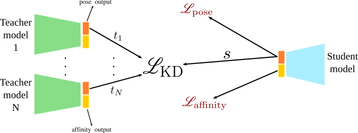

# GNINA Knowledge Distillation

This is the repository for the paper ["Condensing Molecular Docking CNNs via Knowledge Distillation"](https://doi.org/10.26434/chemrxiv-2024-0jh8g). Where knowledge distillation (KD) is used to condense the pose ranking power of ensembles of CNN models into a single model. We use the CNN models from [GNINA](https://github.com/gnina/gnina), an open-source docking tool modeling protein and ligand as grids in 3D space using [libmolgrid](https://github.com/gnina/libmolgrid) and using CNN as the scoring function. 

Ensemble KD transfers the knowledge learned by multiple teacher models to a single student model by minimizing the discrepancy between the outputs of the teachers and the student. Here, the objective is to leverage ensemble knowledge distillation to condense knowledge from the finetuned ensemble model used in GNINA into a single model, resulting in shorter running times while maintaining or improving performance compared to a single scoring function model.




## Environment 
The pipeline is implemented in Python 3.9 and PyTorch. 

Some packages are required:
* `torch`
* `scipy`
* `sklearn`
* `molgrid`

[GNINA](https://github.com/gnina/gnina) should be installed following their official guide for benchmarking purposes.

## Data
Training data of the models can be found [here](https://github.com/gnina/models/).


## Knowledge Distillation Pipeline
### Model Conversion
GNINA originally uses caffemodel for CNN training. To adapt it to Pytorch Knowledge distillation, the GNINA teacher model should firstly be converted to `.pt` from `.caffemodel` format. This conversion used the implementation [here](https://github.com/vadimkantorov/caffemodel2pytorch). The converted models are also provided under `/model`.

### Running Knowledge Distillation
User arguments are defined as:
```
--teacher_models  a list of input teacher models from GNINA
--output          output address
--save_epoch      the number of epoch periods to save models
--student_arch    student model architecture to distill to, options are ["Default2018", "Dense"]

--trligte         training ligand molcache file
--trrecte         training receptor molcache file
--trainfile       training sample list
--reduced_test    subset of testing sample list for validation
--teligte         testing ligand molcache file
--terecte         testing receptor molcache file
--testfile        testing sample list

--binary_rep      if use a binary representation of the atoms, default=False
--lr              learning rate, default=0.001
--dropout, -d     dropout rate, default=0
--weight_decay    weight decay for SGD optimier, default=0.001
--T               temperature for softmax function, default=1
--clip            gradient clip, default=10
--epochs          number of epochs, default=10000
--batch_size      batch size, default=50

--step_when       lr decreases if validation loss doesn't decrease after 1000 * step_when iterations
--step_end_cnt    total times for lr decreasing
--use_weight      load a model weight file

--job_name        name of the job shown in the wandb, default=None if no wandb will be used
--project         name of the project in wandb
--user            user name of the wandb
```

Files needed to train different types of model:
| Model | Train lig | Train rec | Train file | Test lig | Test rec | Test file | Validation File | 
|----------|----------|----------|----------|----------|----------|----------|----------|
| General_Default2018 | gen2_docked_uff_lig.molcache2 | gen2_docked_uff_rec.molcache2 | stratify_gen_uff_train0.types | test_lig.molcache2 | test_rec.molcache2 | test.types | gen_uff_train0.types | 
| Redock_Default2018 | crossdock2020_1.3_lig.molcache2 | crossdock2020_1.3_rec.molcache2 | stratify_it2_redocked_tt_v1.3_completeset_train0.types | test_lig.molcache2 | test_rec.molcache2 | test.types | reduced_it2_redocked_tt_v1.3_completeset_train0.types |
| Crossdock_Default2019 | crossdock2020_1.3_lig.molcache2 | crossdock2020_1.3_rec.molcache2 | stratify_it2_tt_v1.3_completeset_train0.types | test_lig.molcache2 | test_rec.molcache2 | test.types | reduced_it2_tt_v1.3_completeset_train0.types |
| Dense | crossdock2020_1.3_lig.molcache2 | crossdock2020_1.3_rec.molcache2 | stratify_it2_tt_v1.3_completeset_train0.types | test_lig.molcache2 | test_rec.molcache2 | test.types | reduced_it2_tt_v1.3_completeset_train0.types |

Example command for distilling General_Default2018 models into a single Default2018 model:

```
python script/KD_pipeline.py --teacher_models general_default2018.caffemodel.pt general_default2018_2.caffemodel.pt general_default2018_3.caffemodel.pt general_default2018_4.caffemodel.pt --trligte gen2_docked_uff_lig.molcache2 --trrecte gen2_docked_uff_rec.molcache2 --trainfile stratify_gen_uff_train0.types --teligte soup_validation_lig.molcache2 --terecte soup_validation_rec.molcache2 --testfile soup_validation.types --reduced_test gen_uff_train0.types --student_arch Default2018 --step_when 88 --step_end_cnt 4 --output /user/GNINA_KD
```

## Benchmark the distillation using GNINA
### Data
The benchmark is performed on two tasks: Redocking and Crossdocking.

Both filtered datasets can be downloaded from [here](https://bits.csb.pitt.edu/files/gnina1.0_paper/). Only the `crossdocked_ds_data.tar.gz` and `redocking_all_data.tar.gz` files are needed to be downloaded and extracted. 

### Benchmark Pipeline
1. Model conversion
To evaluate the distilled `.pt` model using GNINA, we first need to convert it back to `.caffemodel` using the following command:

Usage:
```
python script/pytorch_to_caffe.py -I *.pt -O *.caffemodel -A default2018/dense
```

2. Run GNINA
Then, we need to run GNINA for all the docking tests using the distilled model.

For Redocking data, use commands like
```
gnina -r PDBbind_refined_2019/5IHH/5IHH_PRO.pdb.gz -l PDBbind_refined_2019/5IHH/5IHH_LIG.sdf.gz --autobox_ligand PDBbind_refined_2019/5IHH/5IHH_LIG.sdf.gz --cnn_scoring rescore --cpu 1 --seed 420 --out PDBbind_refined_2019/5IHH/5IHH_SUFFIX.sdf.gz --cnn_weights MODEL.caffemodel --cnn_model default2018.model
```

For Crossdocking data, use commands like
```
gnina -r wierbowski_cd/AOFB/2C64_PRO.pdb -l wierbowski_cd/AOFB/2XFN_LIG_aligned.sdf --autobox_ligand wierbowski_cd/AOFB/2C64_LIG_aligned.sdf --cnn_scoring rescore --cpu 1 --seed 420 --out wierbowski_cd/AOFB/2C64_PRO_2XFN_LIG_SUFFIX.sdf.gz --cnn_weights MODEL.caffemodel --cnn_model default2018.model
```

Users should change SUFFIX in the `--out` and `--cnn_weights` for specific distilled models. Besides, --cnn_model should be changed based on whether the distilled model is Default2018 or Dense architecture.

Two examples `.txt` files are provided, which should contain the GNINA commands for all the samples. These `.txt` files are also required for further steps.

3. Collect the docking performance
Run the following commands to automatically get the performance of all docking jobs:

```
python script/obrms_calc.py --input *.txt --dirname PDBbind_refined_2019/ --getscores
```

where `--input` should be replaced with the actual `.txt` file used in the previous step and `--dirname` should use corresponding datasets (PDBbind_refined_2019/ or wierbowski_cd/)

4. Generate CSV format file
For Redocking task, use
```
python script/coalescer.py --dirlist rd_dirs.txt --suffix SUFFIX --dataroot PDBbind_refined_2019 --outfilename Redocking.csv --getscores
```

For Crossdocking task, use
```
python script/coalescer.py --dirlist cd_dirs.txt --suffix SUFFIX --dataroot wierbowski_cd --outfilename Crossdocking.csv --getscores
```

SUFFIX is what we used in step 2.

5. Evaluate the performance
To get the Top1 performance on Redocking:
```
python script/MakeReDockCSVs.py --input folder --output Redocking_Top1.csv
```

To get the Top1 performance on Redocking:
```
python script/MakeCrossDockCSVs.py --input folder --output Redocking_Top1.csv
```

